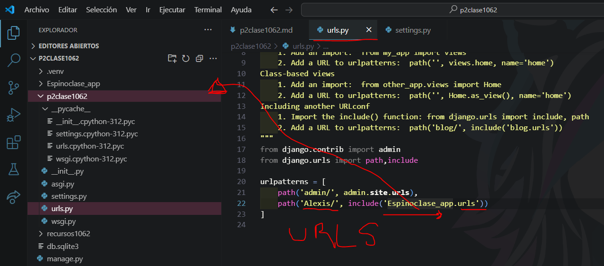

- crear aplicacion Espinoclase_app
- comando --> python manage.py startapp Espinoclase_app
- creamos el archivo urls.py en Espinoclase_app
- 
- en setting.py de p2clase1062
- 
- en urls.py de p2clase1062
- 
- en urls.py en Espinoclase_app
- 
- en views.py en Espinoclase_app
- 
- en urls.py en Espinoclase_app
- 